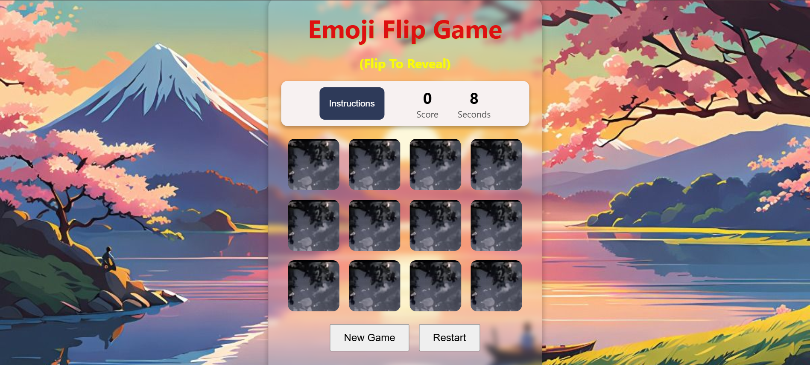
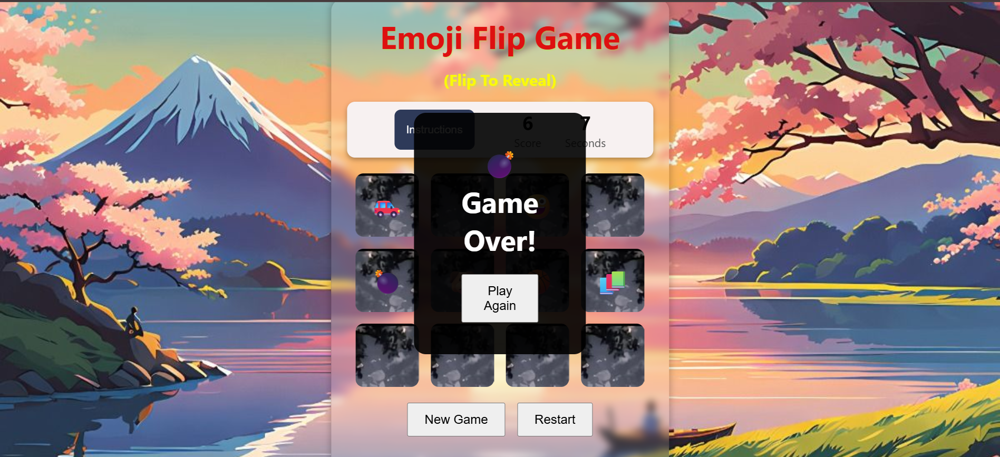

# 🎮 Emoji Flip Game  

A fun and interactive memory card game built with **HTML, CSS, and JavaScript** where players flip emoji cards to find matching pairs. Simple, engaging, and perfect for practicing logic skills!  

---

## 🚀 Live Demo  
👉 **[Play the Live Game Here](https://souravgour-17.github.io/Emoji_flip_game/)**  

---

## 📌 Table of Contents  
- [About](#-about)  
- [Features](#-features)  
- [Screenshots](#-screenshots)  
- [How to Play](#-how-to-play)  
- [Live Demo](#-live-demo)  
- [Tech Stack](#-tech-stack)  
- [Installation](#-installation)  
- [Contributing](#-contributing)  
- [License](#-license)  

---

## ℹ️ About  
The **Emoji Flip Game** is a classic memory-matching card game where the goal is to flip and match pairs of emoji cards. It’s lightweight, browser-based, and works without any external libraries.  

---

## ✨ Features  
✔️ Fun & colorful emoji-based design  
✔️ Interactive flip animation  
✔️ Keeps track of your moves  
✔️ Fully responsive – works on mobile & desktop  
✔️ Simple and fast gameplay  

---

## 📸 Screenshots  

👉 Place your screenshots inside a folder named **`screenshots/`** in your repo.  
Example structure:  
Emoji_flip_game/
│── index.html
│── style.css
│── script.js
│── screenshots/
│── start.png
│── match.png
│── end.png

yaml
Copy code

| Game Start | Game Over |
|------------|-----------|
|  |  |

---

## 🕹 How to Play  
1. Click on any card to flip it.  
2. Flip another card to find its pair.  
3. If both cards match ✅, they stay flipped.  
4. If they don’t ❌, they flip back.  
5. Continue until all pairs are matched 🎉.  

---

## 🛠 Tech Stack  
- **HTML5**  
- **CSS3**  
- **JavaScript (ES6)**  

---

## 📥 Installation  
1. Clone the repository  
   ```bash
   git clone https://github.com/souravgour-17/Emoji_flip_game.git
Open index.html in any browser.

🤝 Contributing
Contributions are welcome! Follow these steps:

Fork the repo

Create a new branch (feature-new)

Commit your changes

Push to your branch

Open a Pull Request 🎉

📜 License
This project is licensed under the MIT License.

✨ Built with ❤️ by Sourav Gour